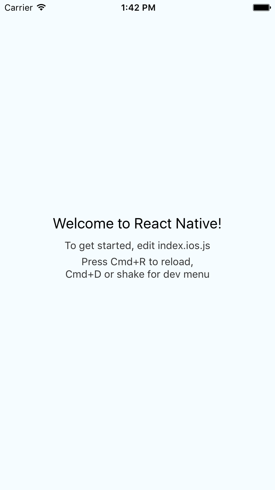
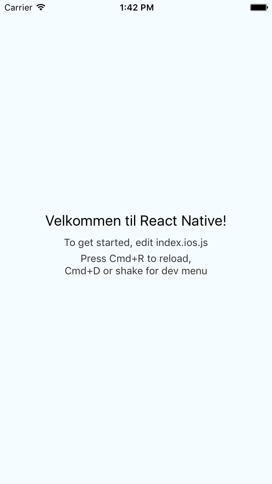
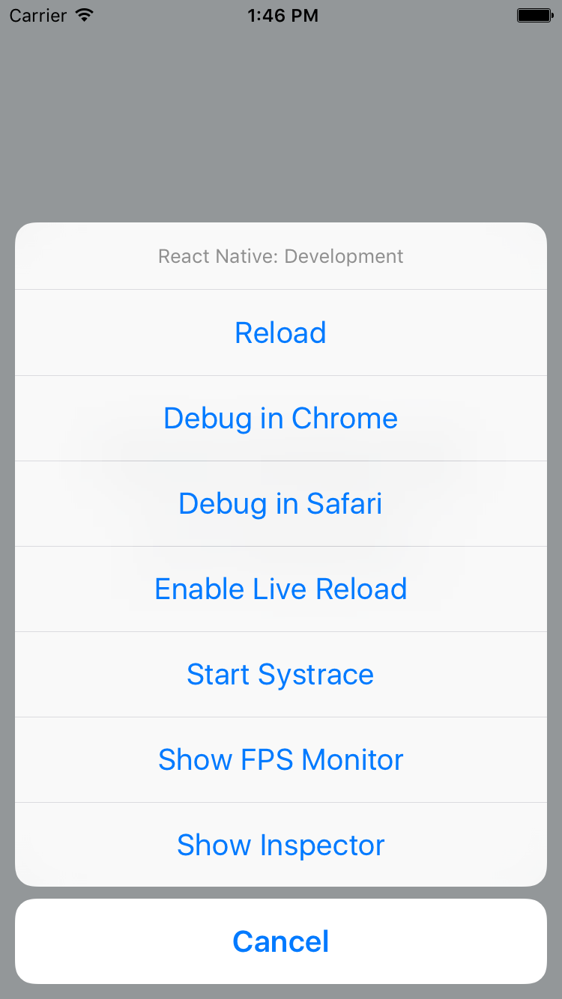
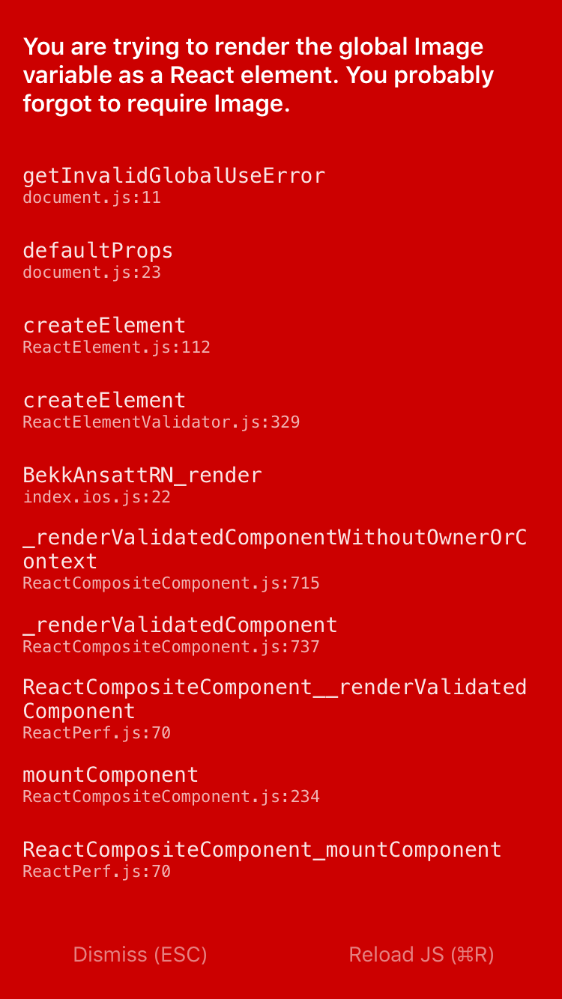
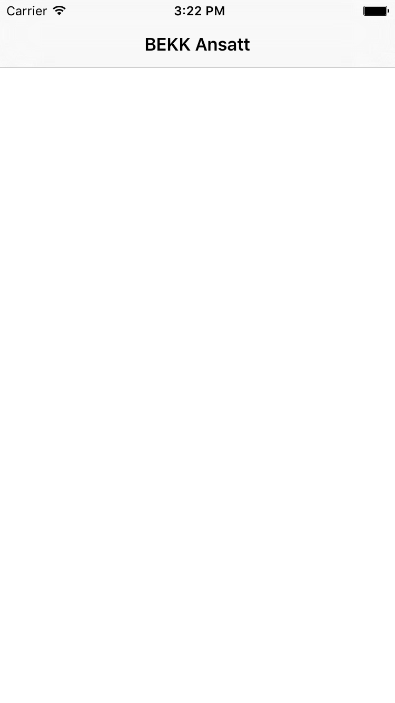
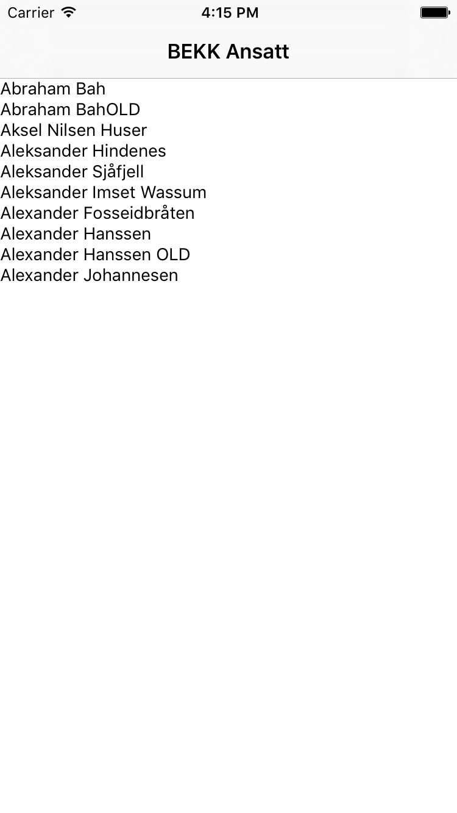
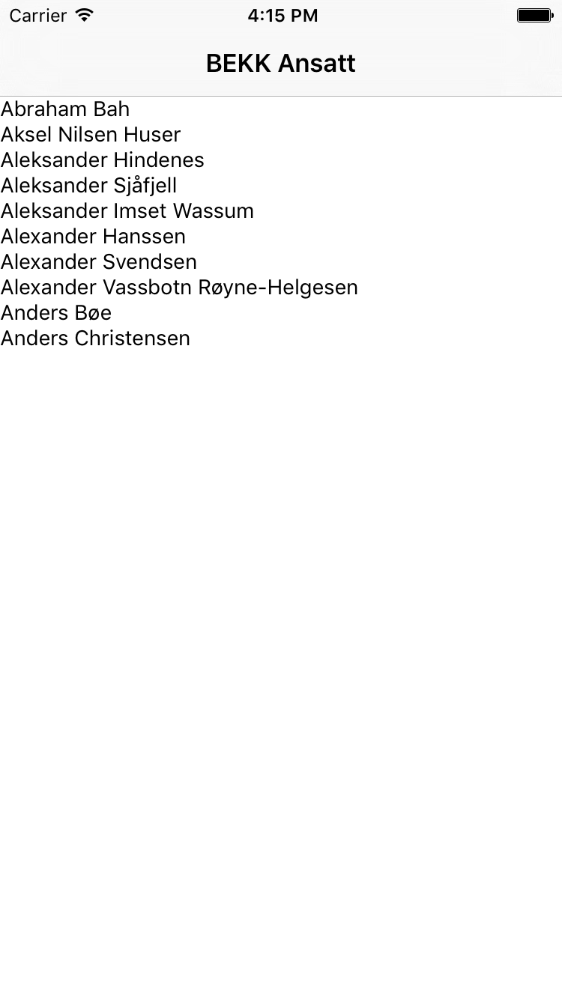
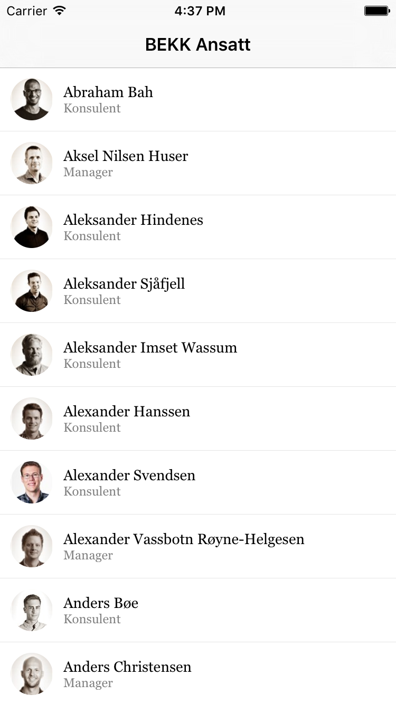
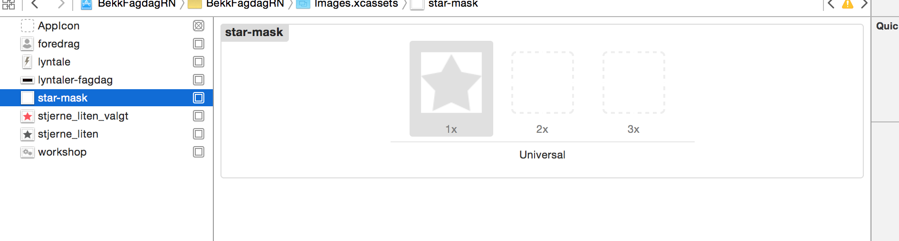
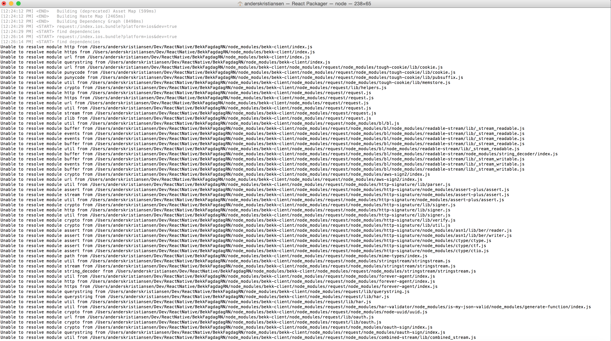

# Første møte med React Native

Facebook introduserte React Native under React.js i januar, og lanserte React Native som Open Source under F8 i mars. Den gang kun med støtte for iOS, men React Native for Android ble lansert i september.

## Hva er React Native?

React Native bygger på React.js, og litt forenklet kan man si at DOMen for web er byttet ut med native komponenter for iOS og Android. Så man skriver fortsatt Javascript, men får ut native apps i andre enden. I bunnen er det samme React-kjernen som på web. Dette er enda tydeligere siste versjon av React (0.14) der react-modulen splittes i react og react-dom.

Potensielt kan gjenbruke mye av kodebasen i en eksisterende React.js-app, og det er noe av det jeg ønsket å utforske. Men det er viktig å understreke at med React Native streber ikke Facebook etter "write once, run anywhere", men heller "learn once, run everywhere". De så internt i Facebook at de satt på mye god Javascript-kompetanse, og ikke minst mange personer med god domenekunnskap på bestemte produkter i Facebook. Derfor ønsket man at disse utviklerne kunne implementere samme funksjonalitet, på tvers av plattformer.
Med React Native har man tilgang til de kjente og kjære bibliotekene og APIene man er vant til fra webben.

En viktig punkt er at en React Native app er ikke en HTML-app pakket inn i en native wrapper. Komponentene transformeres til native komponenter, så appen virkelig føles og yter som en native app. Facebook ville ikke ødelegge den native ytelsen, og de utnytter derfor at man kan kjøre flere tråder på native kontra på web. Alt arbeid gjøres asynkront i tråder utenfor UI-tråden, køes opp, og sendes i batcher til UI-tråden for å minimere antall operasjoner på UI-tråden. 

I tillegg har man tilgang til alle interne API-er som en native app har. De mest vanlige API-ene er allerede tilgjengelig gjennom React Native, mens andre kan kan skrive og eksponere gjennom React Native sin Javascript-bridge. Mer om dette senere.

React Native brukes aktivt internt i Facebook, og det burde derfor drive utvikling og feilretting videre. De har laget hele "Ads Manager" i React Native for iOS og Android, mens "Groups"-appen og Facebook-appen er hybrider med React Native og ren native kode.

## Take 1. En liten app fra scratch

### Intro til React Native

For å teste hvordan det er å komme i gang fra scratch laget jeg en liten app som lister ut ansatte i BEKK.

For å utvikle i React Native må man ha en Macintosh-maskin med Node.js, XCode for iOS og Android SDK for Android.
Dette er godt beskrevet på https://facebook.github.io/react-native/docs/getting-started.html.

Når alle avhengigheter er lastet ned og installert kjører man
>npm install -g react-native-cli
>
>react-native init BekkAnsattRN

React setter da opp all nødvendig kode for å starte utvikling. Inkludert XCode-prosjekt og js-filer for å starte på henholdsvis iOS og Android.

Da er det bare å starte opp XCode, åpne prosjektet, `⌘-R` og simulatoren åpner seg. I bakgrunnen starter React Packager som bygger appen og lytter på endringer man gjør.
På dette tidspunktet kan man gjemme bort XCode og bare la simulatoren kjøre.



"All" videre koding kan man gjøre i Javascript i sin favoritt-editor. Og nå kommer det umiddelbart ga meg en god utviklingsfølelse. Gjør en endring i .js-filen, `⌘-R` i simulatoren, og i løpet av 1 sekund ser man endringen man nettopp gjorde. Man kan også sette på auto-refresh i simulatoren dersom man ønsker det. Det er slik man ønsker å jobbe, spesielt når man sitter og gjør små justeringer i brukergrensesnittet. En slik endring i native kode krever å bygge og deploye appen på nytt i simulatoren, og da snakker man fort mange sekunder.




Når vi først er inne på utviklingsmiljøet er Chrome debugging et kjærkomment verktøy for en webutvikler. Siden appen kjører Javascript kan man kjøre appen i Chrome og utnytte debuggingverktøyet som man er kjent med fra webben.



Og skulle man en skjelden gang gjøre en kodefeil viser appen dette tydelig, "in your face", og ikke bortgjemt i en logmelding. Her har jeg f.eks glemt å importere en komponent. Feilmeldingen gir i de fleste tilfeller en klar beskjed på hvor og hva man har gjort feil. Og legger man til editoren sin i .bashrc på denne måten, `export REACT_EDITOR=atom`, kan man klikke direkte i simulatoren og få opp linjen med feil direkte i teksteditoren. Små ting som gjør utviklingen smidigere.



Men tilbake til appen, og til kode. Jeg tar utgangspunkt i boilerplate-koden som React Native genererte for å vise noen konsepter.

```js
/**
 * Sample React Native App
 * https://github.com/facebook/react-native
 */
'use strict';

var React = require('react-native');
var {
  AppRegistry,
  StyleSheet,
  Text,
  View,
} = React;
```

Dette er som vi kjenner fra React, men vi importerer i stedet `react-native`.
Deretter bruker vi "destructuring assignment" fra ES6, som lar oss hente ut komponentene fra React Native på en litt enklere måte enn å skrive `React.AppRegistry`, `React.StyleSheet` osv. React Native bruker Babel Javascript compiler, slik at man står fritt til å bruke store deler av ES6.


```js
var BekkAnsattRN = React.createClass({
  render: function() {
    return (
      <View style={styles.container}>
        <Text style={styles.welcome}>
          Velkommen til React Native!
        </Text>
        <Text style={styles.instructions}>
          To get started, edit index.ios.js
        </Text>
        <Text style={styles.instructions}>
          Press Cmd+R to reload,{'\n'}
          Cmd+D or shake for dev menu
        </Text>
      </View>
    );
  }
});
```

Dette er kjent for de fleste som har sett React før. En render-funksjon som rendrer denne komponenten.
Vi ser her at `<div>` har blitt til `<View>` og `<span>` har blitt til `<Text>`. React Native pakker inn native komponenter i en deklarativ syntaks, som gjør det lettere å lese og forstå hvordan et view vil se ut. Man slipper mye 'matematikk' og beregning av posisjoner og størrelser. Man sier hvordan man vil at view skal se ut, så "fikser React resten". Man trenger ikke å måle, og lese fra view for å se hvordan det ser ut, for så gjøre endringer på det.

I Objective-C måtte man instansiert ulike views, lagt de til som subviews på et container view. Noe ala dette:

```
[self.view addSubview:welcomeText];
[self.view addSubview:instructionsText];
[self.view addSubview:anotherInstructionsText];
```

```js
var styles = StyleSheet.create({
  container: {
    flex: 1,
    justifyContent: 'center',
    alignItems: 'center',
    backgroundColor: '#F5FCFF',
  },
  welcome: {
    fontSize: 20,
    textAlign: 'center',
    margin: 10,
  },
  instructions: {
    textAlign: 'center',
    color: '#333333',
    marginBottom: 5,
  },
});
```

Her defineres stilene. Det finnes ikke CSS og klasser i React Native. Vi bruker inline styles, og sender inn objekter. Det ligner på CSS, gjør det ikke? React Native bruker en reimplementasjon av et subset av CSS. For layout brukes "Flexbox", og dette fungerer veldig bra. I mange tilfeller fant jeg det enklere å legge ut komponenter med Flexbox enn med Interface builder i XCode eller i native kode. Et enkelt, men vanlig "problem", vertikal sentrering av tekst, lot seg enkelt løse.
Siden man jobber med objekter er det ikke noe i veien for å definere variabler globalt, også trekke inn globale stiler. F.eks farger, fonter etc. Style-attributet kan også ta imot en liste med stiler, og objektet kan inneholde boolske verdier for å styre stilen.

Rasjonalet bak CSS i JS skal jeg ikke ta her, men det finnes her:  https://speakerdeck.com/vjeux/react-css-in-js


```js
AppRegistry.registerComponent('BekkAnsattRN', () => BekkAnsattRN);
```

Dette er er selve limet mellom JS og native kode. I Xcode finner man
```
RCTRootView *rootView = [[RCTRootView alloc] initWithBundleURL:jsCodeLocation
                                                      moduleName:@"BekkAnsattRN"
                                               initialProperties:nil
                                                   launchOptions:launchOptions];
```

som binder JS-appen til et native view. Det er på denne måten man kan inkludere React Native i delere av en eksistende app. I Facebook-appen er f.eks 'arrangementer' skrevet i React Native, mens resten er Objective-C. Men man merker ikke forskjellen, fordi alt føles native.


### La oss kode

Appen kommer til å bestå av en liste med ansatte, som man skal kunne klikke på for å se detaljer for den ansatte.
Da må vi ha en form for navigasjon mellom ulike views. Her bruker jeg iOS sin innebygde navigator, som React Native eksponerer gjennom `NavigatorIOS`.

```js
'use strict';

var React = require('react-native');
var {
 AppRegistry,
 StyleSheet,
 NavigatorIOS,
} = React;

var AnsattListe = require('./AnsattListe');

var BekkAnsattRN = React.createClass({

 render: function() {
   return (
     <NavigatorIOS
     style={styles.container}
     initialRoute={{
       title: 'BEKK Ansatt',
       component: AnsattListe
     }}
     />
   );
 }
});

var styles = StyleSheet.create({
 container: {
   flex: 1
 },
});

AppRegistry.registerComponent('BekkAnsattRN', () => BekkAnsattRN);
```

Dette er kun for å starte opp NavigatorIOS med komponenten AnsattListe, som jeg skal ta for meg nå.

```js
'use strict';

var React = require('react-native');
var {
  StyleSheet,
  View,
  ListView,
  Text,
} = React;


var AnsattListe = React.createClass({
  getInitialState() {
    var dataSource = new ListView.DataSource({rowHasChanged: (r1, r2) => r1 !== r2});

    return {
      dataSource: dataSource.cloneWithRows([]),
    };
  },

  render() {
    return (
      <View style={styles.listContainer}>
        <ListView
        dataSource={this.state.dataSource}
        renderRow={this.renderRow}
        />
      </View>
    );
  },

  renderRow(ansatt) {
    return (
      <View>
        <Text>{ansatt.Name}</Text>
      </View>
    );
  }
});


var styles = StyleSheet.create({
  listContainer: {
    flex: 1
  },
});

module.exports = AnsattListe;
```

Her har vi en `ListView`. Den har noen funksjoner man må implementere. `dataSource`, som definerer en liste med elementer som skal rendres, og `renderRow`, som returnerer hvordan en rad skal rendres.




Her skjedde det ikke mye, siden vi ikke har noe data enda. Jeg gjør det enkelt og legger inn ansatte som en statisk fil.
Denne listen settes inn i dataSource i `getInitialState`:
```js
dataSource: dataSource.cloneWithRows(ansatte),
```

Da ser det slik ut:



Her ser det ut som noe må filtreres. Og siden vi jobber i Javascript har vi tilgang til Underscore.


```js
filterAnsatte() {
  return ansatte.filter((ansatt) => (ansatt.Status == 'I jobb' || ansatt.Status == 'Permisjon'|| ansatt.Status == 'Midlertidig ansatt'));
}
```



Men det ser ikke bra ut enda. Listen rendrer ikke nok elementer før man begynner å scrolle.

Man kan fortelle `ListView` til å rendre flere elementer initielt ved å sende inn `initialListSize={30}`.

Da ser det slik ut. 


Ikke helt prima enda. På tide å fikse litt på visningen.
```js
'use strict';

var React = require('react-native');
var {
  StyleSheet,
  View,
  Text,
  TouchableHighlight,
  Image,
} = React;

var AnsattRad = React.createClass({
  render() {
    return (
      <TouchableHighlight underlayColor='#CCCCCC'>
        <View style={styles.row}>
        <Image
          style={styles.image}
          source={{uri: `https://intern.bekk.no/Employees/ViewEmployeeImage.ashx?thumbnail=true&thumbsize=80&employee=${this.props.ansatt.Id}`}}
         />
          <View style={styles.rowText}>
            <Text style={styles.text}>{this.props.ansatt.Name}</Text>
            <Text style={styles.subtext}>{this.props.ansatt.Seniority}</Text>
          </View>
        </View>
      </TouchableHighlight>
    );
  },
});


var styles = StyleSheet.create({
  row : {
    flex: 1,
    flexDirection: 'row',
    alignItems: 'center',
    paddingHorizontal: 10,
    paddingVertical: 10,
    borderBottomWidth: 0.5,
    borderBottomColor: 'rgba(0, 0, 0, 0.1)',
  },
  rowText: {
    flex: 1,
     justifyContent: 'flex-start',
   },
  image: {
    flexDirection: 'column',
    justifyContent: 'center',
    borderRadius: 20,
    backgroundColor: '#CCCCCC',
    width: 40,
    height: 40,
    marginRight: 10,
  },
  text: {
     flex: 1,
     fontFamily: 'Georgia'
  },
  subtext: {
    fontSize: 12,
    color: 'grey',
    fontFamily: 'Georgia',
  },
});

module.exports = AnsattRad;
```

Her er rendring av listeraden trukket ut i en egen komponent, og stylet med Flexbox. 
Da ser det slik ut:



Scrolling i ca 400 rader føles veldig "smooth", og vi slipper å tenke på lasting av bilder. Det hentes asynkront, og vises så fort de er klare. Alt jeg gjorde var å spesifisere en url som source i en `Image`-tag.

En ansattrad er pakket inn i `TouchableHighlight`, som er det samme som en knapp. Denne kan vi knytte på en `onPress` funksjon, slik at den gjør noe. Denne kan vi f.eks. sende inn som en property fra `AnsattListe`.

Vi ønsker at klikk skal sende oss til en detaljside for en ansatt.
La oss lage denne siden først:

```js
'use strict';

var React = require('react-native');
var {
  StyleSheet,
  View,
  Text,
  ScrollView,
  Image,
} = React;

var PhoneLink = require('./PhoneLink');
var EmailLink = require('./EmailLink');
var v = require('./variables');

var AnsattProfil = React.createClass({
  render() {
    return (
      <ScrollView style={styles.container}>
        <View style={styles.ansattCard}>
          <Image
            style={styles.profileImage}
            source={{uri: `https://intern.bekk.no/Employees/ViewEmployeeImage.ashx?thumbnail=true&thumbsize=235&employee=${this.props.ansatt.Id}`}}
           />
          <Text style={styles.name}>{this.props.ansatt.Name.toUpperCase()}</Text>
          <View style={styles.hr}/>
          <Text style={styles.title}>{this.props.ansatt.Title.toUpperCase()}</Text>
          <Text style={styles.department}>{this.props.ansatt.Department.toUpperCase()}</Text>
          <PhoneLink style={styles.phone} phoneNumber={this.props.ansatt.MobilePhone} name={this.props.ansatt.Name}/>
          <EmailLink style={styles.email} email={this.props.ansatt.Email} name={this.props.ansatt.Name}/>
        </View>
      </ScrollView>
    );
  },


});


var styles = StyleSheet.create({
  container: {
    flex: 1,
    fontSize: 20,
    padding: 20,
    backgroundColor: v.BEKKBlack,
  },
  ansattCard: {
    flex: 1,
    backgroundColor: 'white',
    padding: 20,
    alignItems: 'center',
  },
  profileImage: {
    width: 100,
    height: 100,
    borderRadius: 50,
    backgroundColor: '#E5E5E5',
    marginBottom: 10,
  },
  name: {
    fontFamily: v.fontFamily,
    fontWeight: 'bold',
  },
  title: {
    fontFamily: v.fontFamily,
  },
  department: {
    fontFamily: v.fontFamily,
    marginBottom: 20,
  },
  phone: {
    fontFamily: v.fontFamily,
  },
  email: {
    fontFamily: v.fontFamily,
  },
  hr: {
    borderBottomWidth: 2,
    borderBottomColor: '#e9555f',
    marginTop: 15,
    marginBottom: 15,
    width: 70,
  },
});

module.exports = AnsattProfil;
```

`emailLink` og `phoneLink` er to moduler som bruker native komponenter til å kalle henholdsvis epostappen og telefonappen.

```js
'use strict';

var React = require('react-native');
var {
  StyleSheet,
  Text,
  LinkingIOS,
  AlertIOS
} = React;

var PhoneLink = React.createClass({

  render() {
    return (
      <Text style={this.props.style} onPress={this.callPhone}>{this.props.phoneNumber}</Text>
    );
  },
  callPhone() {
    var call = function() {
      var url = 'tel:' + this.props.phoneNumber;
      LinkingIOS.canOpenURL(url, (supported) => {
        if (!supported) {
          AlertIOS.alert('Can\'t handle url: ' + url);
        } else {
          LinkingIOS.openURL(url);
        }
      });
    }.bind(this);


    AlertIOS.alert(
      'Ring',
      `Vil du ringe ${this.props.name}?`,
      [
        {text: 'Ja', onPress: call},
        {text: 'Nei', onPress: () => console.log("nei")},
      ]
    )
  },

});


var styles = StyleSheet.create({
  listContainer: {
    flex: 1
  },
});

module.exports = PhoneLink;
```

Siden denne funksjonaliteten bruker iOS-spesifikke komponenter er det en fordel å skille denne ut av profilsiden, slik at det vil være lettere å lage tilsvarende funksjonalitet for Android. Jeg har ikke testet dette, men det skal være mulig å skille komponenter vha. filnavn, slik som .android.js og .ios.js.

Hvis vi nå legger til dette i AnsattListe, og sender denne som en property til AnsattRad
```js
selectAnsatt(ansatt) {
  this.props.navigator.push({
    title: ansatt.Name,
    component: AnsattProfil,
    passProps: {ansatt},
  });
},
```
vil AnsattProfil bli pushet på navigasjonsstacken. Dette viser profilsiden, og legger automatisk på en tilbakeknapp til AnsattListe.


Og da har jeg fått til det jeg ønsker med denne appen. 
Jeg kom raskt i gang, og etter hvert som man lærer komponentene og stilsystemet å kjenne er React Native behagelig å utvikle i, og for en så liten app som dette ga det ingen begrensninger og ingen Objective-C-kode.


## Take 2. En liten app fra eksisterende React.js-app

Når jeg først hadde blitt litt bedre kjent med React Native ønsket jeg å se hvor mye man kan gjenbruke av en eksisterende React-webapp. Jeg valgte meg Fagdag-appen. Ikke det at den trenger en native app, for den fungerer glimrende på mobil, men det virket som et overkommelig scope, samtidig som den er litt mer avansert en den lille BEKK Ansatt-appen.

### Steg 1. Importere react-native
Første steg jeg gjorde var å endre all import av `react` til `react-native`. 

### Steg 2. Endre views og styles
Neste steg var å bytte ut alle DOM-tags med React Native tags. Allerede her ser man at man ikke kan flytte weben rett inn i en native app. Og det ønsker man ikke heller. Man ønsker å følge plattformens konvensjoner og design guidelines. Fagdag-appen inneholder en expand-liste, men rader som åpnes ved klikk. Dette er ikke rett frem på native, og ville krevd en customkomponent,  så jeg valgte derfor å splitte innholdet i hver rad til et egen view, og bruke `NavigatorIOS`, slik at klikk på en rad åpner en ny side med innholdet. 

Samtidig med bytte av komponenter la jeg til stiler, og fjernet referanser til klasser.

Jeg fant at mye kunne gjenbrukes. Properties som sendes mellom komponentene var stort sett det samme, og logikk som filtrering og sortering kunne brukes som de var.


```js
return <Talks talks={timeslot.events}
                    startTime={timeslot.start}
                    endTime={timeslot.end}
                    filters={self.props.filters}
                    common={timeslot.common}
                    starred={self.props.starred}
                    starredMode={self.props.starredMode}
                    starCallback={self.props.starCallback}
                    isEnded={moment().diff(moment(timeslot._end)) > -(2 * 60 * 60 * 1000)}
                    key={index} />
```

er ikke veldig ulikt 

```js
this.props.navigator.push({
  title: timeslot.start + timeslot.common?  '' : '- ' + timeslot.end,
  component: Talks,
  passProps: {    talks: timeslot.events,
                  startTime: timeslot.start,
                  endTime: timeslot.end,
                  filters: self.props.filters,
                  common: timeslot.common,
                  starred: self.props.starred,
                  starredMode: self.state.selectedIndex === 0,
                  starCallback: self.props.starCallback,
                  events: self.props.events,
                  isEnded: moment().diff(moment(timeslot._end)) > -(2 * 60 * 60 * 1000),
                },
});
```


Og akkurat denne er litt spesiell, siden vi pusher et view på navigasjonsstacken.

For interne komponenter så det i mange tilfeller så det slik ut:
```js
var isStarred = _(self.props.starred).contains(talk._id);
return <Talk title={talk.title}
      contents={talk.contents}
      tags={talk.tags}
      filters={self.props.filters}
      location={talk.location}
      end={talk.end_time}
              starredMode={self.props.starredMode}
              isStarred={isStarred}
      starCallback={self.props.starCallback}
      key={index}
      id={talk._id} />;   
```

ble til i React Native:

```js
var isStarred = _(this.props.starred).contains(talk._id);
return <Talk title={talk.title}
      contents={talk.contents}
      tags={talk.tags}
      filters={this.props.filters}
      location={talk.location}
      end={talk.end_time}
      starredMode={this.props.starredMode}
      isStarred={isStarred}
      starCallback={this.props.starCallback}
      key={index}
      id={talk._id}
      events={this.props.events}
      navigator={this.props.navigator}/>;
```

Og i selve rendringen av komponenter:

```js
return (<article className={classes}>
          <header>
            <h2 className="talk-title">{talk.title}</h2>
            { extras }
          </header>
          <Paragraphs talk={talk} />
          <Speakers hosts={talk.hosts} />
          <FeedbackButton title={talk.title} hostname={talk.hosts[0].name}/>
        </article>);
```

ble til dette i React Native:

```js
return (<View style={styles.talkDetailsItemLightningTalk}>
      <View style={styles.header}>
        <Text style={styles.talkTitle}>{talk.title}</Text>
        <Text>{ extras }</Text>
      </View>
      <Paragraphs talk={talk} />
      <Speakers hosts={talk.hosts} />
      <FeedbackButton title={talk.title} hostname={talk.hosts[0].name} navigator={this.props.navigator}/>
    </View>);
```


### Steg 3. Bilder
Alle statiske bilder må legges inn i XCode-prosjektet i Images.xcassets, akkurat slik man gjør når man utvikler for native. 



Disse kan så refereres i Javascript på denne måten:

```js
var star = require('image!star-mask');
```

> NB! Når man har lagt inn nye bilder må man bygge Xcode-prosjektet på nytt.

### Steg 4. Fonter
React Native støtter ikke webfonts, så disse må også legges inn som statiske ressurser i XCode. iOS støtter .ttf og .otf

Hvordan dette gjøres finner man oppskrift på her: https://medium.com/@dabit3/adding-custom-fonts-to-react-native-b266b41bff7f

Deretter kan man bruke fontene i stilobjektene på denne måten:

```js
  talkDetailsTime: {
    fontSize: 14,
    fontFamily:'ConduitITCW01-Regular',
  },
```

Akkurat font navnet kan være litt vanskelig å vite, men linken over viser en måte man kan finne det på. 

### Steg 5. Fjerne LocalStorage
Fagdag-appen lagrer hvilke foredrag man har merket med stjerne i `LocalStorage`. `LocalStorage` tilhører webben, mens det tilsvarende i React Native heter `AsyncStorage`. Api-et er stort sett det samme, så her var det bare å bytte 

```js
Stars.prototype.save = function() {
  var stringified = JSON.stringify(this._stars);
  localStorage.setItem('stars', stringified);
}

Stars.prototype.load = function() {
  var stars = JSON.parse(localStorage.getItem('stars'));
  this._stars = sanitize(stars);
};
```

med:
```js
Stars.prototype.save = function() {
  var stringified = JSON.stringify(this._stars);
  AsyncStorage.setItem('stars', stringified);
}

Stars.prototype.load = function() {
  var items = AsyncStorage.getItem('stars').then((items) => {
    if(items !== null) {
      var stars = JSON.parse(items);
      this._stars = sanitize(stars);
    }
  });
};
```


### Steg 6. Kjør opp og test!

Da prøver vi å kjøre opp. Pang! Ja, vi mangler en del dependencies i package.json. Jeg la til de jeg visste var i bruk. `npm install` og prøv igjen. Pang!



Fagdag-appen kjøres i et Node.js kjøretidsmiljø. React Native kjører opp i JavaScriptCore, og har ikke tilgang til en del innebyggede moduler i Node. Her ble det en del 'Googling', og prøving og feiling. Jeg endte til slutt opp med å bruke Webpack til å bundle appen. Det fantes allerede en løsning for dette (https://github.com/mjohnston/react-native-webpack-server). Det er ikke optimalt, da det blir enda en avhengighet, og den kjører saktere enn den vanlig Packageren. Det kan også hende det smeller senere, men nå fikk jeg appen opp og kjøre igjen, og var fornøyd med det. Jeg leste blant annet at Webpack ikke gikk godt sammen med React Native på Android, da man må endre portnummeret appen kjører mot, og det er ikke mulig på Android. Det er også rapportert problemer med transpilering fra ES6 med Webpack og React Native.

For å kjøre igang appen med webpack måtte jeg installere noen nye npm-moduler, legge til en webpack-config, endre index.ios.js til main.js og endre appen til å kjøre mot port 8080. Bygging av appen må nå startes med `npm start` i terminalen. 


### Men React fungerer ikke som React

Da jeg begynte å teste appen ved å merke foredrag med stjerne oppdaget jeg at appen ikke oppførte seg som forventet. Det skjedde ingenting. Ved klikk på en stjerne ble det kalt et callback, som satt en state lengre opp i view-hierarkiet, som automatisk gjør at view (og subviews) rendres på nytt. Men problemet er at når man bruker `NavigatorIOS` ser ikke React på dette som et subview, og props bobler ikke ned og rendrer på nytt. 
Med `Navigator` må man definere en `renderScene`-funksjon for hver "scene" (side) i navigasjonen. Det er denne funksjonen som blir rendret med gjeldende scene som parameter når state endrer seg. 

Nok en runde med Google viste at Facebook ikke bruker `NavigatorIOS` internt, og de frir derfor til open source communityet til å ta tak i issues.  
Facebook bruker `Navigator` internt, og dette understrekes i dokumentasjonen:

> Development belongs to open-source community - not used by the React Native team on their apps.
A result of this is that there is currently a backlog of unresolved bugs, nobody who uses this has stepped up to take ownership for it yet.
> For most non-trivial apps, you will want to use Navigator - it won't be long before you run into issues when trying to do anything complex with NavigatorIOS.

`Navigator` en JavaScript-implementasjon av navigasjonen. Den er mer fleksibel, men jeg synes den var vanskeligere å implementere enn NavigatorIOS, , animasjonene føltes ikke native og man får ikke den "blurry", litt gjennomsiktige navigasjonslinjen. En fordel med `Navigator` er at man kan definere utseende mer selv, med custom `NavigationBar` og at `Navigator` kan brukes på tvers av iOS og Android. Jeg forsøkte også å flytte stjernemerkingen av et foredrag opp i navigasjonslinjen i `NavigatorIOS`. Men dette var ikke mulig da jeg ikke fant noen måte å oppdatere navigasjonen ved endringer i stjernemarkering, og det var heller ikke mulig å endre farge på kun stjerne-ikonet uten å sette farge for hele navigasjonslinjen. 

Hvis man nå allikevel bruker `NavigatorIOS` sier erfaringer fra Internettet og tips fra Facebook at man kan opprette en event som trigges når nye props er tilgjengelig og la barne-viewet lytte på det. Men det bryter med hvordan React skal fungere, og `setProps()`  er deprecated, og kommer til å bli fjernet.

> setProps and replaceProps are now deprecated. Instead, call ReactDOM.render again at the top level with the new props.

Det er derfor ingen god måte å sette nye props på i barne-viewet. Skulle jeg gått i gang med en større applikasjon ville jeg enten vurdert å bruke `Navigator` eller fikset på `NavigatorIOS`, slik at denne fungerer som `Navigator` og oppdaterer gjeldende view på stacken. Det finnes allerede flere npm-moduler basert på `Navigator`, så det kan være en ide å sjekke ut disse før man setter i gang. Det kan være at disse er enklere i bruk. Og siden Facebook bruker denne implementasjonen selv er det stor sjanse for at de optimaliserer animasjonene, slik at det etter hvert føles native. 

For fagdag-appen valgte jeg å legge til event/lytter i views som blir pushet på stacken (med `NavigatorIOS`):  

```js
   mixins: [Subscribable.Mixin],

  componentDidMount: function() {
    this.addListenerOn(this.props.events, 'change:star', this.update);
  },

    update: function(args){
     this.forceUpdate();
 },

```

Da har vi en app som har MVP-funksjonaliteten til en fagdag-app. Nå er ikke dette en type app som nødvendigvis blir noe bedre på på native platform, men den har gitt nyttig kunnskap om hva man bør tenke på tidlig i prosessen, og at valg av komponenter er viktig for den videre utviklingen. Men en kan se for seg visse nativefunksjoner som gjør at denne appen kan få et fortrinn fremfor webappen. F.eks. 3D Touch. Man kan f.eks bruke "Peek and Pop" for å få en forhåndsvisning av et foredrag. Men har vi 3D Touch i React Native. Det bringer meg inn på neste tema, moduler.


### Moduler

Hvis det er en funksjon man savner i React Native er det stoor sannsynlighet for at noen har laget en modul for dette. Et raskt søk på npmjs.com ga 528 resultater på 'react native'. Importering av moduler er (nesten) like enkelt som vi kjenner det fra Javascript-verden. `npm install <modul> -save` og `require(<modul>)` Forskjellen er at man må importere en fil eller to i XCode dersom modulen skal koble native funksjonalitet til Javascript-broen. Jeg testet moduler for å få tilgang til native 'clipboard', og for å finne retningen på skjermen. Dette var utrolig lett å komme i gang med. I flere tilfeller vil vi nok se at ny funksjonalitet først vil komme som npm-moduler. Det ligger allerede ute moduler for 3D touch (noe uferdig) og quick actions som ble introdusert med iOS9 og iPhone 6S. 

Men her kommer litt av ankepunktet med React Native, og noe jeg var litt spent på da jeg begynte å se på React Native. Tiden fra en ny funksjonalitet blir lagt til i iOS SDK til det er tilgjengelig i React Native. Teamet har uttalt at 3D Touch er en såpass viktig og sentral funksjon at den bør ligge i RN-kjernen (https://github.com/facebook/react-native/issues/2934). Men nå, knappe 2,5 måneder etter iOS9 ble kansert, og 2 måneder etter iPhone 6S/6S Plus ble tilgjengelig, er det fortsatt ikke på plass. 

Så hvis man skal ta i bruk det nyeste og hippeste og være klar til release av nye SDKer, må man enten belage seg på å hjelpe til og lage en modul selv, eller kjøre hybrid, og gjøre dette i native kode. Facebook har gjort sistnevnte (enn så lenge), siden de har 3D Touch funksjonalitet i appen.


## Kan man unngå App Store?


# TODO:

- Bilder av fagdagsappen

- ~~Ikke single code base~~
- ~~Deklarativ beskrivelse av view. Tydeligere hvordan ting skal se ut. Mye matematikk. Sier hvordan vi vil at view skal se ut, så "fikser React resten". Trenger ikke å måle, og lese fra view for å se hvordan det ser ut, for så gjøre endringer på det.~~
- Ulik look and feel. Vil følge guidelines for den plattformen vi bygger for. Akkurat nå kan man ikke lage native expreience med web.
- ~~Utviklingsmiljø/fart. Kjent utviklingsmiljø og debugging.  Slipper XCode og å bygge hele tiden. Bedre feilmeldinger.~~
- ~~Kan bruke f.eks Relay, fetch()~~
- Hvorfor native. Bedre brukeropplevelse og funksjonalitet
- ~~Trådhåndtering. Kan parallellisere. Async oppdatering av view. Gjør operasjoner utenfor main thread og køer opp operasjoner(batch) til main thread.~~
- Gesture
- Vil ha brukeropplevelsen fra native, og utviklingsmiløet fra web.(React)
- ~~Brukes internt i Facebook~~
  - ~~Deler av "Groups", Hele Ads Manager, Arrangementer i Facebook-appen(?)~~
- ~~npm moduler. Ligger allerede mange ute. Like enkelt som ellers, men man må importere noen filer i XCode-prosjektet.~~
 - ~~Biblioteker som "Relay"~~
- Er ikke bare enda en JS-bridge til Native. Man får med React også.


- Spørsmål?
  - Hva med mer grafikk-krevende apps, og apps med mange custom-komponenter?
  - Kan vi gjenbruke det vi har løst på web?
  - ~~Hva med nye API-er? Hvor fort kan man ta i bruk f.eks. 3D Touch?~~
  - Hva med å kjøre JS-koden på en server. Slipper man App Store da?

- Utfordringer:
  - ~~Støtte på komponenter som Facebook ikke bruker~~
    - ~~De er ærlige på at de ikke bruker NavigatorIOS, og ber open source community om hjelp på denne komponenten.~~
      - ~~Jeg fant at denne bryter med React sin virkemåte. En childview oppdaterer en state. Dette trigger en re-rendring lenger oppe i view-treet, men disse bobler ikke ned til view som er pushet på Navigator-stacken. React Native teamet bruker Navigator-komponenten, og sier at en løsning er Event-Subscriber. Men det bryter med React, og man må ta hånd om events når state endrer seg.~~
      - ~~Løst i Navigator, men jeg synes den var mer kronglete å bruke, og er en JS abstraksjon, som ikke nødvendigvis stemmer med native oppførsel~~
      - ~~Et annet problem er styling av NavigatorIOS. Prøvde med stjernemarkering. Vanskelig å oppdatere på endringer.~~


- Erfaringer:
  - For å kjøre på fysisk device måtte jeg skru av "Dead code stripping i Xcode".

Har ikke løst det å sende inn environment variabler
